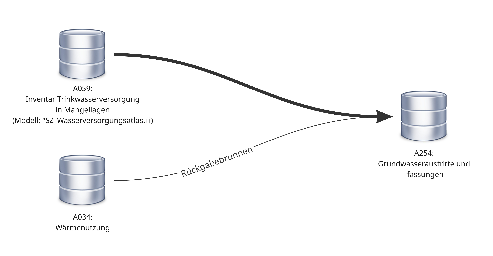

== Allgemeines
=== Ziel und Zweck
Dieses Dokument handelt vom Geobasisdatensatz
 
* *__Grundwasseraustritte, -fassungen und -anreicherungsnalgen__ (A254).*

Dieses Thema ist beim Bund über den gleichnamigen Geobasisdatensatz (ID 141) modelliert. Der Kanton hingegen führt dieses Thema nicht explizit. Die Daten liegen auf zwei verschiedenen Themen und können aus diesen implizit hergeleitet werden, weshalb auf eine zusätzliche Modellierung verzichtet wird. Die beiden Themen sind:

* A059: Inventar der Trinkwasserversorgung in Mangellagen
* A034: Wärmenutzung

Das Thema A059 führt die meisten Klassen, welche als Datenquelle für die Grundwasseraustritte, -fassungen und -anreicherungsanlagen dienen. Das Thema A034 ist lediglich die Datenquelle für die "Rückgabebrunnen" (siehe Abbildung unten).

Da es im Kanton keine Anreicherungsanlagen gibt, wird nachfolgend das Thema als "Grundwasseraustritte und -fassungen" bezeichnet.

=== rechtliche Grundlagen
Seit dem 1. Juli 2008 ist das Bundesgesetz über Geoinformation (GeoIG, SR 510.62) <<allgemeines.adoc#doc-01,[1]>> in Kraft. Am 1. Juli 2012 erfolgte die vollständige Inkraftsetzung des kantonalen Geoinformationsgesetzes (kGeoiG, SRSZ 214.110) <<allgemeines.adoc#doc-03,[3]>>. Es hat zum Ziel, verbindliche Vorgaben für die Erfassung, Modellierung und den Austausch von Geodaten festzulegen.

Am 1. Januar 2013 trat die kantonale Verordnung über Geoinformation (kGeoiV, SRSZ 214.111) <<allgemeines.adoc#doc-04,[4]>> in Kraft. Sie präzisiert das kGeoiG in fachlicher sowie technischer Hinsicht und führt im Anhang 1 den „Katalog der Geobasisdaten des Bundesrechts mit Zuständigkeit beim Kanton“ und im Anhang 2 den „Katalog der Geobasisdaten des kantonalen Rechts“. Darin werden die Fachstellen definiert, welche für die Ausarbeitung eines Geodatenmodells zuständig sind.

=== Zielgruppen
Dieses Dokument richtet sich an folgende Nutzergruppen:

* **Fachstellen für Modellierung,** die den inhaltlichen Rahmen des Themas festlegen,
* **Datenbearbeiterinnen und -bearbeiter,** die sich über die Prozesse und Methoden der Datenpflege informieren,
* **Verantwortliche für die Datenpublikation,** die die Daten entsprechend der Freigabestufe veröffentlichen und die Transformation in andere Modelle durchführen sowie
* **Endnutzerinnen und Endnutzer,** die sich über den Inhalt und die Struktur der Daten informieren möchten.

ifdef::backend-pdf[]
<<<
endif::[]
